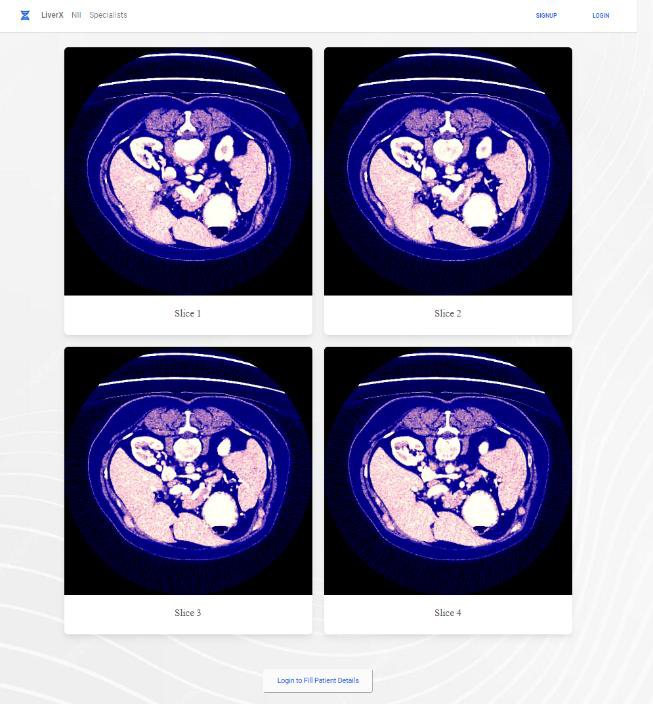
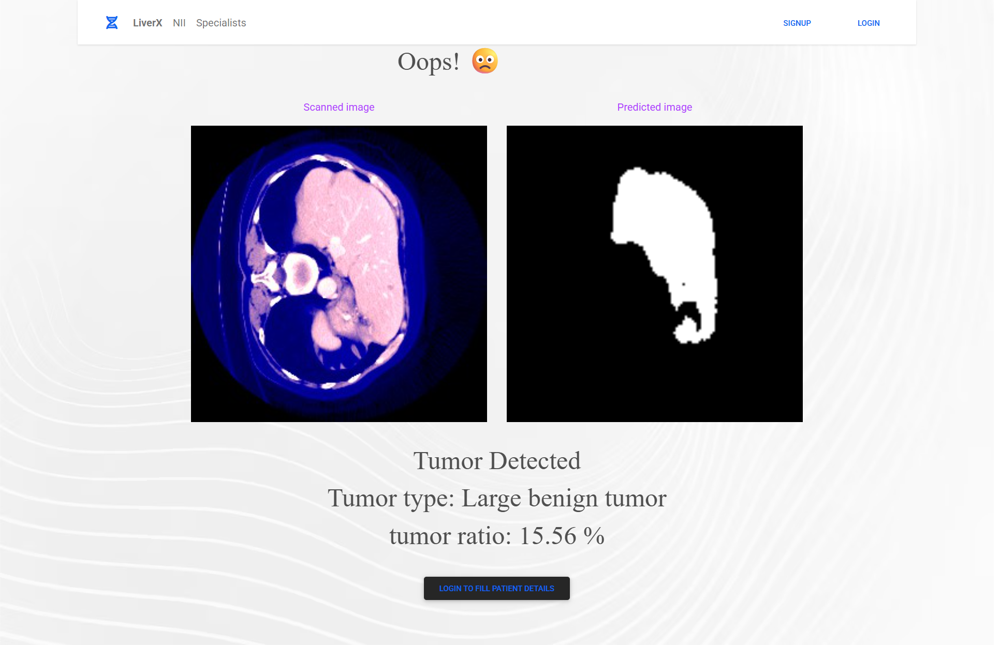
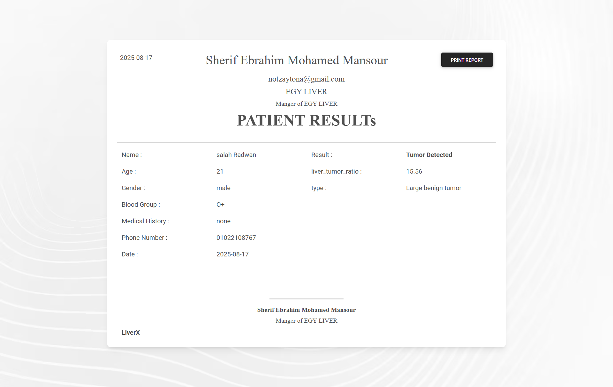
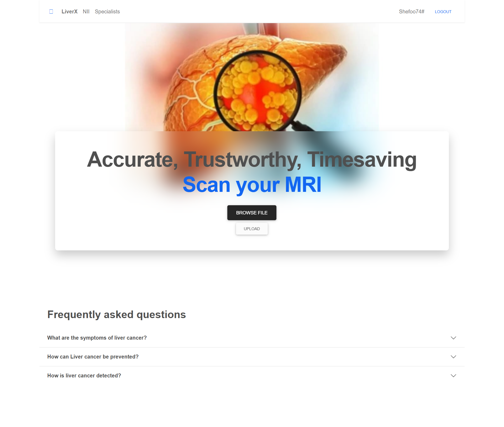
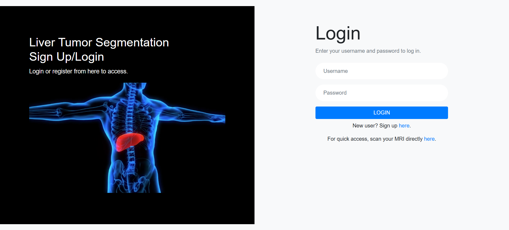

# Liver Tumor Detection

Liver cancer is one of the most prevalent diseases and can be extremely fatal if not properly diagnosed at an early stage. The exponential growth of cells in the liver is termed liver cancer. Due to the complex histology and imaging modalities, early diagnosis is challenging. To better diagnose and treat patient-specific tumors, it is often necessary to segment and visualize them. The huge number of slices in input images presents a significant challenge for physicians.

This project aims to develop an automatic, efficient, and reliable technique for liver tumor segmentation in CT images using a 2D convolutional deep neural network. We propose a pyramid-based UNET model with short skip connections for fast and precise segmentation, which will be helpful for the early detection of tumors. Deep learning and image processing techniques are adopted to develop this liver CT scan segmentation tool.

---

## Project Screenshots

### Nii Image

### Result Image

### Report Image

### Fill Report Image

### Home Page

### Login Page

---

## How to Use
1. Clone the repository.
2. Install the required dependencies (see `requirements.txt`).
3. Run the application using your preferred method (e.g., `python app.py`).
4. Open the web interface.
5. Upload your MRI or CT scan image.
6. View the segmentation and results.

---

## About
- **Technology:** Python, Deep Learning (UNET), Image Processing
- **Goal:** Early and accurate detection of liver tumors to assist physicians
- **Developed at:** National Telecommunication Institute (NTI)
- **Special thanks to:** Eng. Yasmen (Instructor), Salah Radwan (Team Member)

---
